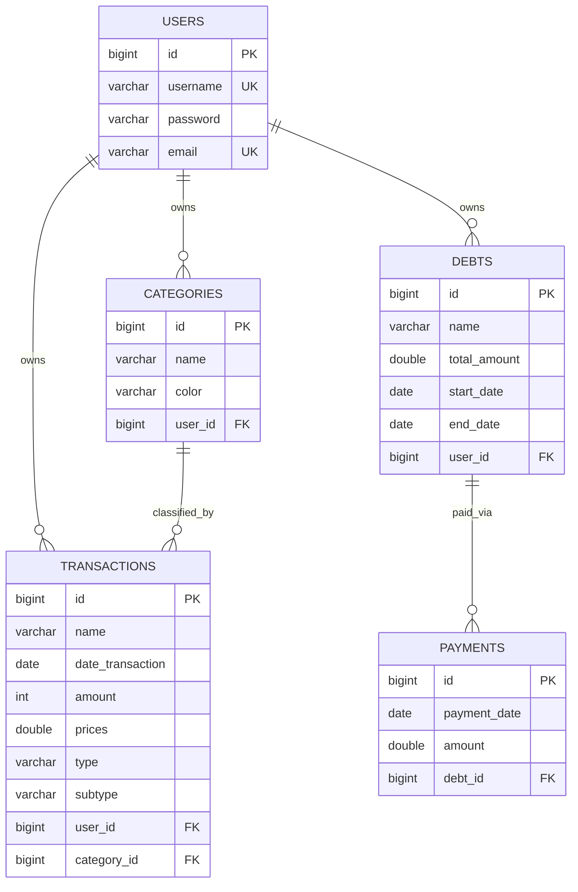

# Money Manager

Personal finance REST API built with Spring Boot 4.1.0 and Java 25.

[](https://expense-manager-new.onrender.com)
[](https://expense-manager-new.onrender.com/swagger-ui/index.html)

## Stack

- **Java 25** + **Spring Boot 4.1.0**
- **PostgreSQL** (localhost:5432 / Render)
- **JWT** (HS256 via jjwt, stateless auth)
- **Spring Security** (BCrypt passwords, filter chain)
- **springdoc-openapi 3.1.0** ([Swagger UI](https://expense-manager-new.onrender.com/swagger-ui/index.html))
- **Lombok**
- **Hexagonal architecture** (domain / application / infrastructure)

## Architecture

```
src/main/java/com/money/manager/
├── domain/                  # Entities, repository interfaces, enums, exceptions, paging
├── application/             # Service ports (interfaces), DTOs, mappers
└── infrastructure/          # Controllers, Spring Security, JPA adapters, config
```

## Entity-Relationship Diagram



## Authentication

Stateless JWT. Every endpoint except login/register/health requires `Authorization: Bearer <token>`.

- **Login** returns a 30-minute HS256 JWT (`TokenResponseDTO`)
- **Register** creates the user (BCrypt) and auto-logins
- Filter chain: `RateLimiterFilter` → `JwtFilter` → `UsernamePasswordAuthenticationFilter`
- Rate limiting: login ≤ 5 req/min, register ≤ 10 req/min (by IP + User-Agent)

## API Endpoints

Full interactive docs: **[Swagger UI](https://expense-manager-new.onrender.com/swagger-ui/index.html)**

### User (`/user`)

| Method | Path | Auth | Description |
|--------|------|------|-------------|
| POST | `/user` | No | Register new user (returns JWT) |
| POST | `/user/login` | No | Login, returns JWT |
| GET | `/user` | Yes | Get current user profile |
| PUT | `/user` | Yes | Update username/email/password |
| DELETE | `/user` | Yes | Delete account (204) |

### Category (`/category`)

| Method | Path | Auth | Description |
|--------|------|------|-------------|
| POST | `/category` | Yes | Create category (name + color) |
| GET | `/category/all` | Yes | List user's categories |
| GET | `/category/{id}` | Yes | Get one category |
| PUT | `/category/{id}` | Yes | Update category |
| DELETE | `/category/{id}` | Yes | Delete category |

### Transaction (`/transaction`)

| Method | Path | Auth | Description |
|--------|------|------|-------------|
| POST | `/transaction` | Yes | Create transaction |
| GET | `/transaction/all` | Yes | Paginated list with filters |
| GET | `/transaction/{id}` | Yes | Get one transaction |
| PUT | `/transaction/{id}` | Yes | Update transaction |
| DELETE | `/transaction/{id}` | Yes | Delete transaction |

**Query params** for `GET /transaction/all`:
- `type` — `income` or `expense`
- `subType` — `fixed` or `variable`
- `from` / `to` — ISO date range (`yyyy-MM-dd`)
- `page` (default 0), `size` (default 10)

### Debt (`/debt`)

| Method | Path | Auth | Description |
|--------|------|------|-------------|
| POST | `/debt` | Yes | Create debt |
| GET | `/debt/all` | Yes | List user's debts (with payments) |
| GET | `/debt/{id}` | Yes | Get one debt |
| PUT | `/debt/{id}` | Yes | Update debt |
| DELETE | `/debt/{id}` | Yes | Delete debt |

### Payment (`/payment`)

| Method | Path | Auth | Description |
|--------|------|------|-------------|
| POST | `/payment` | Yes | Register payment against a debt |
| GET | `/payment/{id}` | Yes | Get one payment |
| PUT | `/payment/{id}` | Yes | Update payment |
| DELETE | `/payment/{id}` | Yes | Delete payment |

### Health

| Method | Path | Auth | Description |
|--------|------|------|-------------|
| GET | `/health` | No | Liveness check |

## Domain

- **User** — id, username, email, password
- **Category** — id, name, color, user
- **Transaction** — id, name, date, amount, price, type (income/expense), subtype (fixed/variable), user, category
- **Debt** — id, name, totalAmount, startDate, endDate, user, payments
- **Payment** — id, paymentDate, amount, debt

### Enums

- **Type**: `INCOME`, `EXPENSE`
- **Subtype**: `FIXED`, `VARIABLE`

## Build & Run

```bash
# Build
mvn clean package -DskipTests -o

# Run (requires PostgreSQL on localhost:5432)
mvn spring-boot:run

# Run tests (unit + controller slice tests need no DB; the full-context test self-skips without PostgreSQL/JWT_KEY)
mvn test
```

## Testing

57 tests (JUnit 5 + Mockito + MockMvc) covering services, controllers and security filters.

### Unit tests

| Test class | Covers |
|------------|--------|
| `application/services/UserServiceImpTest` | login (success / bad credentials), getUser, createUser (password encoding + auto-login), updateUser (with / null / blank password), deleteUser |
| `application/services/TransactionServiceImpTest` | create, get, update, delete, getAll — DTO mapping, ownership checks (`NotFoundException`), pagination sort ASC/DESC, filter forwarding to repository |
| `infrastructure/config/JwtFilterTest` | missing / non-Bearer header, valid token sets authentication with `User` principal, invalid token / unknown user clears `SecurityContext`, `validateToken=false`, existing authentication not overridden |
| `infrastructure/security/RateLimiterFilterTest` | only `POST /user/login` and `POST /user` are limited; 429 JSON body when exceeded; bucket key = endpoint : IP : User-Agent; limits 5/min login, 10/min register |
| `infrastructure/security/RateLimiterServiceTest` | sliding window: allows up to max then blocks, independent buckets per client |

### Integration tests (@WebMvcTest slices)

| Test class | Covers |
|------------|--------|
| `infrastructure/controller/UserControllerTest` | all `/user` endpoints incl. validation errors (400), bad credentials (401), delete returns 204 |
| `infrastructure/controller/TransactionControllerTest` | all `/transaction` endpoints incl. filter forwarding, validation (400), not found (404) |

Controller slices don't require a database or JWT key: services are mocked with `@MockitoBean`, the security filters are excluded from the slice, and a permissive test `SecurityFilterChain` is used so the authenticated principal can be injected per request.

### Full-context smoke test

`ManagerApplicationTests.contextLoads` boots the entire application and requires PostgreSQL on `localhost:5432` plus a `JWT_KEY`. When either is unavailable it is skipped automatically via `@EnabledIf`.

## Environment Variables

### Dev profile

| Variable | Default | Description |
|----------|---------|-------------|
| `JWT_KEY` | *(empty)* | HS256 signing key |
| `JWT_EXPIRATION` | 30 | Token TTL in minutes |
| `JWT_ISSUER` | manager | JWT issuer claim |
| `JWT_AUDIENCE` | money-manager-frontend | JWT audience claim |
| `DATABASE_URL` | `jdbc:postgresql://localhost:5432/money_manager` | JDBC URL |
| `DATABASE_USERNAME` | postgres | DB user |
| `DATABASE_PASSWORD` | *(empty)* | DB password |
| `SPRING_PROFILES_DEFAULT` | dev | Active profile |

### Prod profile

| Variable | Description |
|----------|-------------|
| `POSTGRESQL_URL` | JDBC URL (schema `money_manager` appended automatically) |
| `POSTGRESQL_USER` | DB user |
| `POSTGRESQL_PASSWORD` | DB password |
| `JWT_KEY` | HS256 signing key |
| `PORT` | Server port (Dockerfile default: 8080) |

## Deployment

Multi-stage Dockerfile targeting Render/Vercel-style deployments:

- **Build stage**: `eclipse-temurin:25-jdk` + Maven → `mvn package -DskipTests`
- **Run stage**: `eclipse-temurin:25-jre` → `java -jar app.jar --spring.profiles.active=prod`

Production profile (`application-prod.properties`) reads `POSTGRESQL_URL`, `POSTGRESQL_USER`, `POSTGRESQL_PASSWORD` from environment.

## CORS

Allowed origins:
- `https://money-manager-front-end-weld.vercel.app`
- `https://money-manager-front-end-git-feat-backend-u-90b1de-javi-proyects.vercel.app`
- `https://expense-manager-new.onrender.com`
- `http://localhost:5173`
